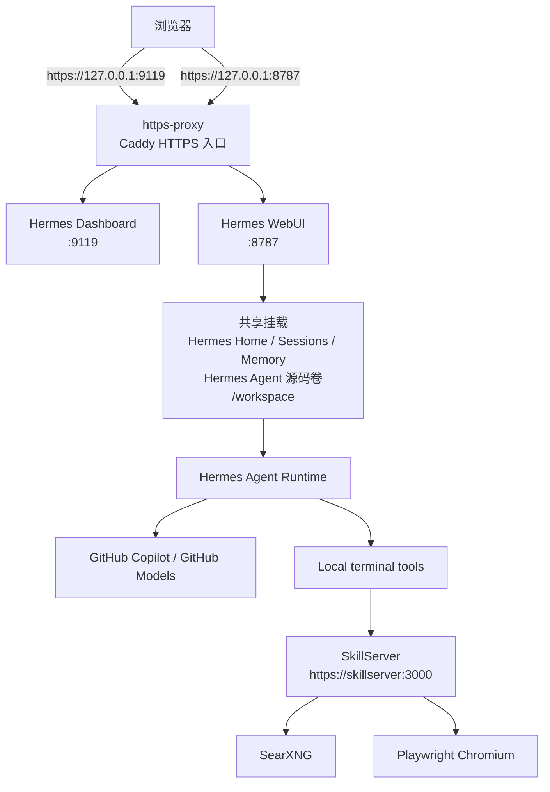

# Hermes Agent Stack

Hermes Agent Stack 是一个本地优先的多服务编排仓库，用 Docker 把 Hermes Gateway、Hermes Dashboard、Hermes WebUI、SkillServer、SearXNG 和一个本地 HTTPS 反代层组合在一起。

当前默认模型链路是 GitHub Copilot / GitHub Models，Web 能力不走 Hermes 内建 `web` / `browser` toolset，而是统一改走本地 SkillServer。聊天前端使用 Hermes WebUI，并且已经按当前仓库的多容器方案做过适配。

## 当前架构

- `hermes` 容器运行 `gateway run`，同时暴露 Hermes API Server。
- `dashboard` 容器复用同一 Hermes 镜像，运行 Dashboard UI 后端。
- `hermes-webui` 容器运行 Hermes WebUI 后端，直接复用 Hermes home、配置、skills、memory 和 sessions。
- `skillserver` 提供本地 HTTPS Web 能力，内部调用 SearXNG 和 Playwright。
- `https-proxy` 复用同一套本地自签证书，把 Dashboard 和 Hermes WebUI 对外统一暴露为 HTTPS。
- `searxng` 只在 Docker 网络内暴露，供 SkillServer 查询。
- 对宿主机开放的只有本地端口：Dashboard HTTPS `9119`、Hermes API `8642`、Hermes WebUI HTTPS `8787`，全部绑定 `127.0.0.1`。




## 仓库结构

```text
.
├── deploy.py
├── docker-compose.yml
├── Dockerfile.hermes
├── Dockerfile.hermeswebui
├── docker/
│   ├── hermes-entrypoint.sh
│   └── https-proxy.Caddyfile
├── hermes/
│   ├── config.yaml
│   ├── SOUL.md
│   └── skills/
│       └── web/
│           └── SKILL.md
├── httpscert/
│   └── tls.cnf
├── searxng/
│   └── settings.yml
└── skillserver/
    ├── Dockerfile.skillserver
    ├── requirements.txt
    ├── server.py
    └── web_core.py
```

## 服务说明

| 服务 | 作用 | 宿主机端口 |
| --- | --- | --- |
| `hermes` | Hermes Gateway + API Server | `8642` |
| `dashboard` | Hermes Dashboard 后端 | 不直接暴露 |
| `hermes-webui` | Hermes WebUI 后端 | 不直接暴露 |
| `https-proxy` | Dashboard / WebUI 的 HTTPS 入口 | `9119` / `8787` |
| `skillserver` | 本地 Web 能力 HTTPS 服务 | 不直接暴露 |
| `searxng` | 搜索后端 | 不直接暴露 |

## 运行前提

- Docker Desktop 已启动
- Python 3.11+
- GitHub Copilot Enterprise 或 Business 账号

`deploy.py` 只依赖 Python 标准库，不要求先安装额外 Python 包。

## 快速开始

### 1. 克隆仓库

```bash
git clone https://github.com/JscSatoshi/HermesAgentStack.git
cd HermesAgentStack
```

### 2. 可选：创建本地虚拟环境

如果你想在宿主机上单独运行脚本或工具，可以创建本地 `.venv`：

```bash
python3 -m venv .venv
source .venv/bin/activate
```

### 3. 首次部署

```bash
python3 deploy.py
```

首次执行会自动完成这些步骤：

1. 检查 Docker 引擎
2. 写入 `.env` 默认值和随机密钥
3. 通过 GitHub Device Flow 获取 `GITHUB_TOKEN`
4. 自动生成共享本地自签 TLS 证书，并把 CA 信任链打进需要访问 SkillServer 的镜像
5. 构建本地镜像（`hermes-agent:local`、`hermes-webui:local`、`skillserver:local`）
6. 启动整套容器
7. 依次检查 Dashboard、API Server、Hermes WebUI、SkillServer、SearXNG 连通性
8. 打印 Hermes WebUI 当前可见的 Copilot 可用模型列表

启动完成后，默认访问地址：

- Hermes Dashboard: `https://127.0.0.1:9119`
- Hermes WebUI: `https://127.0.0.1:8787`
- Hermes API Server health: `http://127.0.0.1:8642/health`

首次从浏览器打开 Dashboard 或 Hermes WebUI 时，会看到本地自签证书提示。这是预期行为。你可以直接手动信任，或者把 `httpscert/local-ca.crt` 导入本机信任链后再访问。

## 常用命令

```bash
python3 deploy.py
python3 deploy.py --start
python3 deploy.py --stop
python3 deploy.py --build
python3 deploy.py --build --force
python3 deploy.py --newtoken
python3 deploy.py --check
python3 deploy.py --logs
```

命令说明：

- `python3 deploy.py`：完整部署；镜像不存在时自动构建，随后启动并检查服务
- `python3 deploy.py --start`：启动或重启现有容器，再做健康检查
- `python3 deploy.py --stop`：停止并移除容器
- `python3 deploy.py --build`：只构建镜像
- `python3 deploy.py --build --force`：无缓存重建镜像
- `python3 deploy.py --newtoken`：重新走 GitHub Device Flow，刷新 `.env` 里的 `GITHUB_TOKEN`
- `python3 deploy.py --check`：做健康检查，并打印 Hermes WebUI 当前可见的 Copilot 模型列表
- `python3 deploy.py --logs`：跟随查看容器日志

`deploy.py` 会自动优先使用 `docker compose`，如果环境里只有 `docker-compose` 也会自动回退。当前 `--start` 不会再无条件重建镜像；只有 `--build` 或 `--force` 才会触发构建。
如果你已经在 `.env` 里手动固定了 `HERMES_UID` / `HERMES_GID`，`deploy.py` 不会再把它们覆盖回当前宿主机用户。

## 配置文件

### `.env`

仓库提供 `.env.example`，实际运行时由 `deploy.py` 自动补默认值或生成密钥。

| 变量 | 说明 |
| --- | --- |
| `GITHUB_TOKEN` | GitHub Copilot / GitHub Models token |
| `HERMES_UID` | 容器内 Hermes 进程 UID |
| `HERMES_GID` | 容器内 Hermes 进程 GID |
| `HERMES_DASHBOARD_PORT` | Dashboard HTTPS 本地端口，默认 `9119` |
| `API_SERVER_PORT` | Hermes API Server 端口，默认 `8642` |
| `API_SERVER_KEY` | Hermes OpenAI-compatible API Bearer Key |
| `HERMES_WEBUI_PORT` | Hermes WebUI HTTPS 本地端口，默认 `8787` |
| `TZ` | 时区，默认 `Asia/Shanghai` |
| `SEARXNG_SECRET` | SearXNG 密钥 |

如果你需要把 Hermes WebUI 暴露到非 localhost，再额外设置：

- `HERMES_WEBUI_PASSWORD`：Hermes WebUI 登录密码

`deploy.py` 还会在根目录 `httpscert/` 下自动生成本地开发用 TLS 文件，并由 SkillServer、Dashboard HTTPS 入口、Hermes WebUI HTTPS 入口共同复用：

- `local-ca.crt` / `local-ca.key`：本地 CA
- `local-ca.srl`：本地 CA 的签发序列号文件
- `local-https.crt` / `local-https.key`：签给 `skillserver`、`localhost`、`127.0.0.1` 的共享服务端证书
- `local-https.csr`：服务端证书签名请求
- `local-https.fullchain.crt`：服务端证书 + CA 链
- `tls.cnf`：共享 TLS 配置模板

这些文件只用于本机 Docker 网络，不会提交到 git。

如果你要在宿主机上用 `curl` 或其他 CLI 工具直连这些 HTTPS 入口，建议显式带上 CA，并优先使用 `localhost`：

```bash
curl --cacert httpscert/local-ca.crt https://localhost:9119/
curl --cacert httpscert/local-ca.crt https://localhost:8787/health
curl --cacert httpscert/local-ca.crt 'https://localhost:8787/api/models/live?provider=copilot'
```

在当前这套本地自签证书 + Caddy 反代组合下，浏览器访问 `127.0.0.1` 没问题，但宿主机侧的 `curl` / Python TLS 检查优先用 `localhost` 更稳。

### `hermes/config.yaml`

当前 Hermes 配置重点：

- 模型提供方：`copilot`
- 默认模型：`claude-opus-4.6`
- 辅助文本 / 视觉任务：显式固定到 `gpt-4o`，避开当前 Copilot token 下 `gpt-5.4` 在 Hermes 链路里的 `model_not_supported` 问题
- 终端后端：`local`
- 工作目录：`/workspace`
- 外部 skills 目录：`/workspace/hermes/skills`
- 显式禁用 Hermes 原生 `web` 和 `browser` toolset

这意味着仓库里的 Web 访问统一通过 `hermes/skills/web/SKILL.md` 指向本地 SkillServer。

### `hermes/SOUL.md`

Hermes 人设文件定义了默认交互风格：中文优先、直接、偏工程化、先做事再解释。

## Bootstrap 与持久化

`docker/hermes-entrypoint.sh` 在 `hermes` 和 `dashboard` 容器启动时会做这些事情：

1. 按 `.env` 的 `HERMES_UID` / `HERMES_GID` 调整容器内用户
2. 把 `hermes/config.yaml` 复制到持久化目录中的 `config.yaml`
3. 把 `hermes/SOUL.md` 复制到持久化目录中的 `SOUL.md`
4. 初始化 Hermes home 下的 `sessions`、`logs`、`memories`、`skills` 等目录

为避免随着数据增长导致每次重启都递归扫描整个 Hermes home，入口脚本现在只修正 Hermes home 根目录和必要 bootstrap 文件的 owner，而不再对整个数据目录做 `chown -R`。

当前 Docker 卷：

- `hermes-home`：Hermes 持久化数据
- `hermes-agent-src`：共享给 Hermes WebUI 的 Hermes agent 源码目录
- `hermes-webui-app`：持久化 Hermes WebUI 运行目录 `/app`，避免每次重建容器都重新创建 venv 并安装依赖
- `hermes-webui-uv-cache`：持久化 Hermes WebUI 的 uv 缓存目录，减少首次安装和异常恢复时的重复下载
- `searxng-config`：SearXNG 配置目录
- `searxng-cache`：SearXNG 缓存目录，同时复用为 SkillServer 截图目录

## Hermes WebUI 集成方式

当前 Hermes WebUI 不是通过 OpenAI-compatible API 反代到 Hermes，而是直接复用 Hermes agent 的配置与状态：

- `hermes-home` 同时挂给 `hermes`、`dashboard`、`hermes-webui`
- `hermes-agent-src` 从 `hermes` 容器共享 Hermes 源码给 `hermes-webui`
- `hermes-webui-app` 持久化上游 Hermes WebUI 的 `/app` 目录，让 `/app/venv/.deps_installed` 在容器重建后依然存在
- `hermes-webui` 也挂载整个仓库到 `/workspace`
- `Dockerfile.hermeswebui` 额外安装 `git`、`ripgrep`、`ffmpeg`，并导入 SkillServer 本地 CA

这样 Hermes WebUI 里的聊天会话能直接使用：

- 当前仓库工作区文件
- `hermes/config.yaml` 里的模型与工具配置
- `hermes/skills/web/SKILL.md` 提供的本地 Web 能力
- Hermes 持久化 memory / sessions / skills

## SkillServer 能力

SkillServer 是一个 FastAPI 服务，统一封装了搜索、网页抓取、结构化提取和截图功能，并通过本地自签证书提供 HTTPS。

当前接口：

| 接口 | 说明 |
| --- | --- |
| `/health` | 健康检查 |
| `/search` | 通过 SearXNG 做快速搜索 |
| `/deep_search` | 搜索后并发抓取页面正文 |
| `/navigate` | 抓取渲染后的页面内容，支持 `text` / `html` |
| `/extract_text` | 从 CSS selector 提取文本 |
| `/extract_links` | 提取页面链接 |
| `/headlines` | 提取页面标题层级 |
| `/screenshot` | 截图并返回 `MEDIA:` 路径 |

实现细节：

- `skillserver/server.py` 提供 FastAPI HTTPS 接口
- `skillserver/web_core.py` 负责 SearXNG 查询、Playwright 渲染、URL 校验和并发控制
- 默认会阻止 `localhost`、回环地址和私有网络地址，避免代理访问宿主机内网资源

## Hermes Web Skill

`hermes/skills/web/SKILL.md` 明确要求 Hermes 不使用原生 web/browser toolset，而是通过终端执行：

```bash
curl -s --max-time 15 "https://skillserver:3000/search?q=YOUR+QUERY"
```

因此，这个仓库里的网页能力链路是：

1. Hermes 触发本地 `web` skill
2. skill 在终端里调用 `https://skillserver:3000/...`
3. SkillServer 再访问 SearXNG 或 Playwright
4. Hermes 整理结果后返回给用户

## 健康检查

`python3 deploy.py --check` 当前会依次验证：

1. Hermes Dashboard HTTPS 可访问
2. Hermes API Server `/health` 可访问
3. Hermes WebUI HTTPS `/health` 可访问
4. SkillServer `https://127.0.0.1:3000/health` 正常
5. SkillServer 容器内可访问 `http://searxng:8080/`
6. `hermes`、`hermes-dashboard`、`hermes-webui`、`skillserver`、`searxng` 容器都存在
7. Hermes WebUI `/api/models/live?provider=copilot` 返回完整模型列表

## 排障建议

| 问题 | 处理方式 |
| --- | --- |
| `deploy.py` 提示 Docker 未运行 | 先启动 Docker Desktop，再重试 |
| Dashboard 打不开 | 运行 `python3 deploy.py --check`，确认 `9119` 未被占用，并接受本地自签证书 |
| Hermes WebUI 打不开 | 确认 `8787` 端口未冲突，并接受本地自签证书后再查看 `python3 deploy.py --logs` |
| Hermes WebUI 里看不到工作区文件 | 检查 `HERMES_UID` / `HERMES_GID` 是否匹配当前宿主机用户 |
| Hermes WebUI 里执行 `git` / `rg` 失败 | 重新构建 `hermes-webui:local`，确认当前运行的不是旧镜像 |
| GitHub 模型鉴权失败 | 运行 `python3 deploy.py --newtoken` 刷新 `GITHUB_TOKEN` |
| Hermes 不会搜索网页 | 检查 `hermes/config.yaml` 是否禁用了原生 web/browser，同时 `hermes/skills/web/SKILL.md` 是否存在 |
| SkillServer 抓网页失败 | 查看 SkillServer 日志，并确认目标 URL 不在私有网络或本地地址范围内 |
| 改了 `hermes/config.yaml` 或 `hermes/SOUL.md` 没生效 | 重新执行 `python3 deploy.py --start`，让 bootstrap 文件重新复制进 Hermes home |

## 开发备注

- `Dockerfile.hermes` 会克隆指定版本的 `NousResearch/hermes-agent`，在镜像内创建独立虚拟环境，并编译 Dashboard 前端
- `Dockerfile.hermeswebui` 基于官方 Hermes WebUI 镜像扩展本仓库所需工具链与 SkillServer CA 信任
- `skillserver/Dockerfile.skillserver` 在镜像内安装 Playwright Chromium 依赖
- `docker/https-proxy.Caddyfile` 负责把 Dashboard 和 Hermes WebUI 统一包装成 HTTPS 出口
- 根目录 `.venv` 只是宿主机本地开发环境，不参与容器运行
